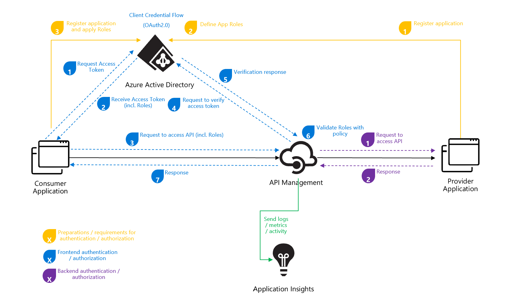

# ais-apim-oauth-flow
OAuth flow with Azure AD and Azure API Management explained and deployed.

## Build Status

| GitHub Action | Status |
| ----------- | ----------- |
| Build | [](https://github.com/pascalvanderheiden/ais-apim-oauth-flow/actions/workflows/build.yml) |
| Release | [](https://github.com/pascalvanderheiden/ais-apim-oauth-flow/actions/workflows/release.yml) |

## About

I receive a lot of questions around this topic. That's why I thought, well maybe it's a good idea to script the architecture mentioned [here](https://docs.microsoft.com/en-us/azure/api-management/api-management-howto-protect-backend-with-aad) so you can try it out yourself. I learn by doing, and hopefully, so do you.

I've split the deployment in 2 parts, a build script and a release script. The build script basically deploys the cloud infrastructure, and the release script deploys the API and the related Azure AD components, like App Registrations, Service Principals, App Roles. So everything that is related to the API and it's policy.

You can deploy it via GitHub Actions and manually via [manual-deploy.ps1](deploy/manual-deploy.ps1).

I found some articles very usefull when creating this repository. [This](https://docs.microsoft.com/en-us/azure/healthcare-apis/register-application-cli-rest) is a nice example on how to create a App Registration via the Az Cli.
I wasn't that familiar with jmespath for defining my queries in my az commands, and [this](https://www.azurecitadel.com/cli/jmespath/) article really helped.

I've included the Open ID Connect config in my JWT validation as well. This is optional but very recommmended, as with rule will enforce validation at Azure AD. This [link](https://techcommunity.microsoft.com/t5/azure-paas-blog/restricting-api-management-access-to-users-through-aad/ba-p/2116259) show where you can see that in the trace.

## Architecture



## Prerequisites

* Install [Visual Studio Code](https://code.visualstudio.com/download)
* Install [REST Client](https://marketplace.visualstudio.com/items?itemName=humao.rest-client) Extension for Visual Studio Code.
* Install Chocolatey (package manager)

```ps1
Set-ExecutionPolicy Bypass -Scope Process -Force; [System.Net.ServicePointManager]::SecurityProtocol = [System.Net.ServicePointManager]::SecurityProtocol -bor 3072; iex ((New-Object System.Net.WebClient).DownloadString('https://community.chocolatey.org/install.ps1'))
```

* Install Bicep CLI

```ps1
choco install bicep
```

* Install Az Module in PowerShell

```ps1
Install-Module -Name Az -AllowClobber -Scope CurrentUser
```

## Deploy Manually

* Git Clone the repository

```ps1
git clone https://github.com/pascalvanderheiden/ais-apim-oauth-flow.git
```

I've included all the steps in 1 Powershell script. This will create all the needed resources. Keep in mind that this will take a while to deploy.

I've used these variables:

```ps1
$subscriptionId = "<subscription_id>"
$tenantId = "<tenant_id>"
$deploymentNameBuild = "<deployment_name_build>"
$deploymentNameRelease = "<deployment_name_release>"
$namePrefix = "<project_prefix>"
$apiName = "<api_name>" # Note: don't use any spaces.
$apiPath = "<api_path>"
$appReaderPassword = "<secret_for_app_reg_reader>" # Note: min. 8 char with capital,number,symbol.
$appWriterPassword = "<secret_for_app_reg_writer>" # Note: min. 8 char with capital,number,symbol.
# For removing soft-delete
$apimName = "<apim_name>"
```

```ps1
.\deploy\manual-deploy.ps1 -subscriptionId $subscriptionId -tenantId $tenantId -deploymentNameBuild $deploymentNameBuild -deploymentNameRelease $deploymentNameRelease -namePrefix $namePrefix -apiName $apiName -apiPath $apiPath -appReaderPassword $appReaderPassword -appWriterPassword $appWriterPassword
```

* Remove the APIM Soft-delete

If you deleted the deployment via the Azure Portal, and you want to run this deployment again, you might run into the issue that the APIM name is still reserved because of the soft-delete feature. You can remove the soft-delete by using this script:

```ps1
.\deploy\del-soft-delete-apim.ps1 -subscriptionId $subscriptionId -apimName $apimName
```

* Testing

I've included a [tests.http](tests.http) file with relevant tests you can perform, to check if your deployment is successful.

## Deploy with Github Actions

* Fork this repository

* Generate a Service Principal

```ps1
az ad sp create-for-rbac -n <name_sp> --role Owner --sdk-auth
```

Copy the json output of this command.

* Update GitHub Secrets for customizing your deployment

In the repository go to 'Settings', on the left 'Secrets', 'Actions'.
And pass the json output in the command used above into the secret 'AZURE_CREDENTIALS'.

The following secrets need to be created:

* AZURE_SUBSCRIPTION_ID
* AZURE_TENANT_ID
* LOCATION
* DEPLOYMENT_NAME_BUILD
* DEPLOYMENT_NAME_RELEASE
* PREFIX
* API_NAME
* API_PATH
* APPREG_READER_PWD
* APPREG_WRITER_PWD

### Trigger

You can trigger the GitHub Build Action from GitHub manually, this will trigger the Release Action as well. I've you want to implement CI-CD, just check the section in the GitHub Action that I've commented out.